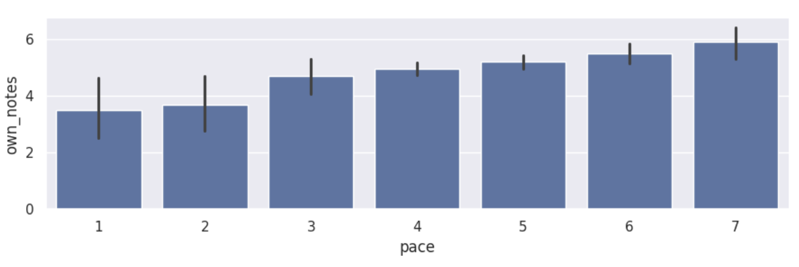
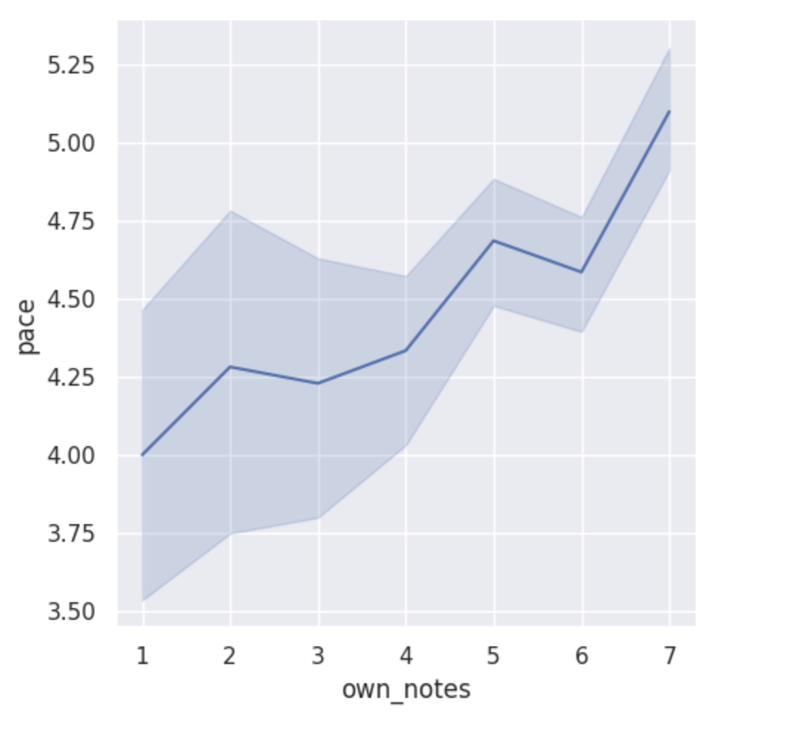
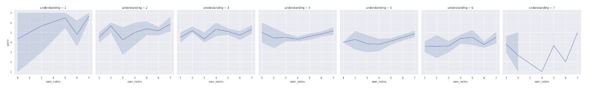

---
# Do not edit the text between these lines!
layout: default
---

# The Idea:
Our idea to analyze with available data was that this course should move at a faster pace because it will make it easier for students to stay focused and engaged in class.
This idea is more valuable than some of the others that we brainstormed because it is the simplest fix, and pacing relates to many other factors. Pacing is important - too slow, and students lose interest, too fast, and students get lost. If students can’t focus and follow along, they can become bored and tune out information they think they already know, or they can become confused and struggle to catch up and complete work on time. Each of these extremes negatively impact understanding and academic performance. Thus optimal pacing will enhance both student satisfaction in the class and student engagement, which will boost learning.
Analysis was performed that compared the variable “pace” (rated 1-7 on a scale of too slow to too fast), as it compares to note taking, understanding, interest, and prior experience. The results of these analyses are presented below.

<!-- This is a comment. Below, you'll see code for inserting an image. To make this image appear, update <custom-path>. To add an image, save it inside the imgs folder of this repository. -->
/static/imgs/logo.png" alt="Image of Comp110 rainbow logo. "  width="500"/>

## Analysis:
## Note Taking as it relates to a Pacing Perspective:

The first bar graph shows that regardless of how much students take notes in class, they feel that the pacing of the class is mostly moderate, though there is a slight positive relationship.

The line graph shows that the people who take more notes are the ones who feel that the class is paced faster, however, there is only about a one point difference pacing persepctive within the range of note-taking.

The series of line graphs that make up the third visual representation of this section add in an additional factor: understanding. These graphs show a similar minimal trend in pacing perspective across note-taking lines, but they reveal that generally, those with a greater level of understanding feel that the pace of COMP110 is moving more slowly.

