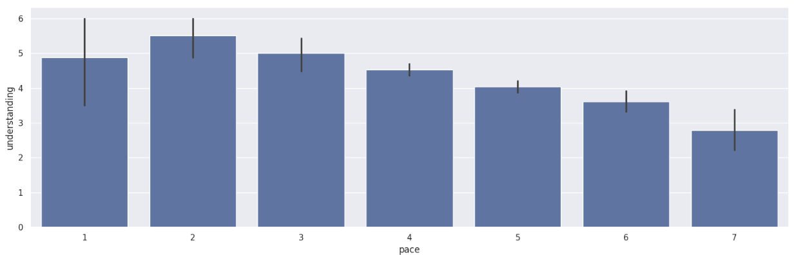
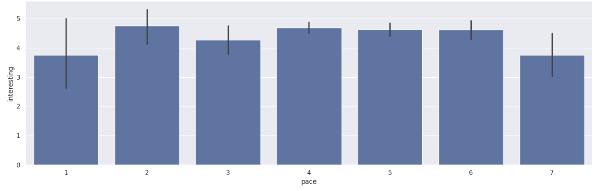
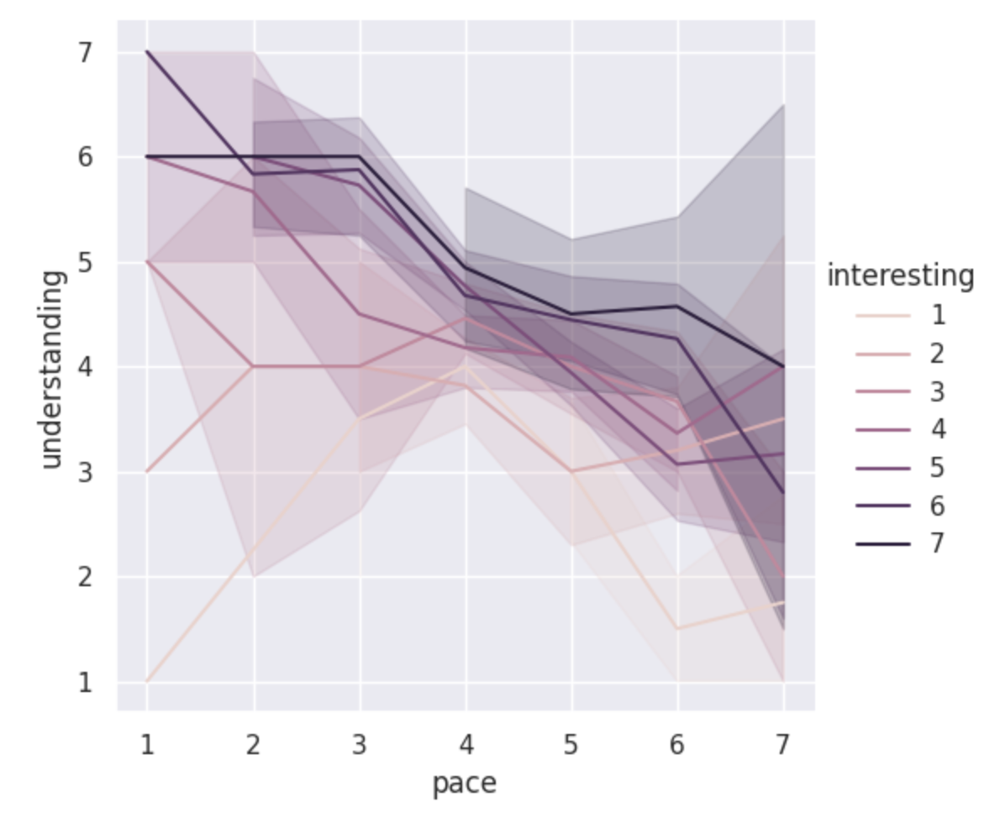
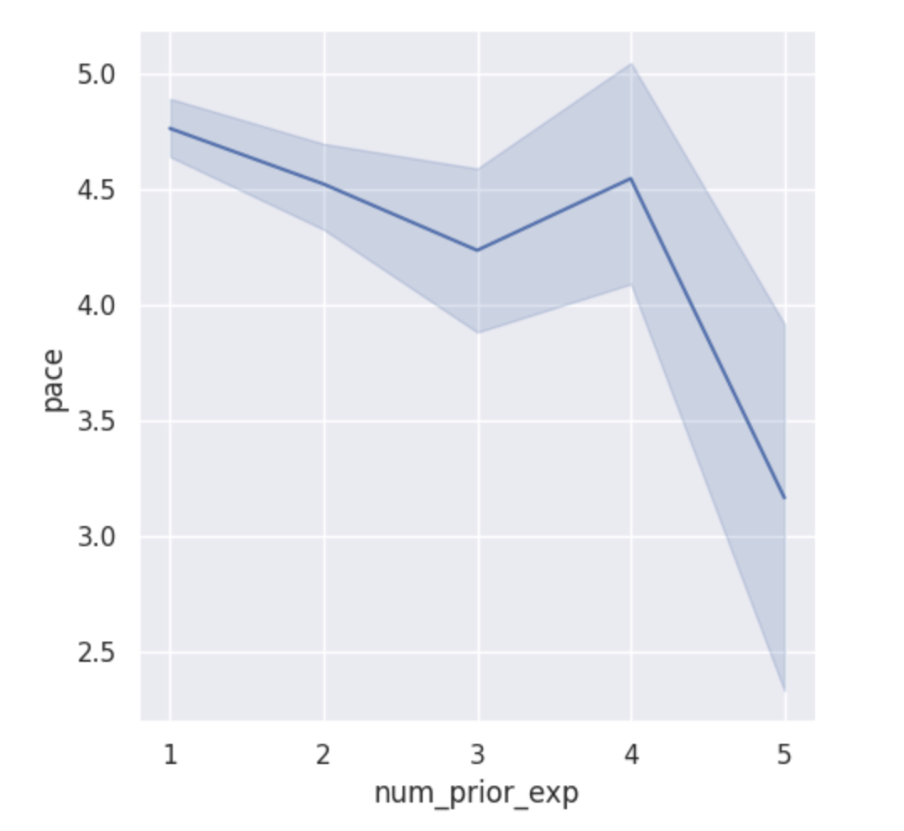
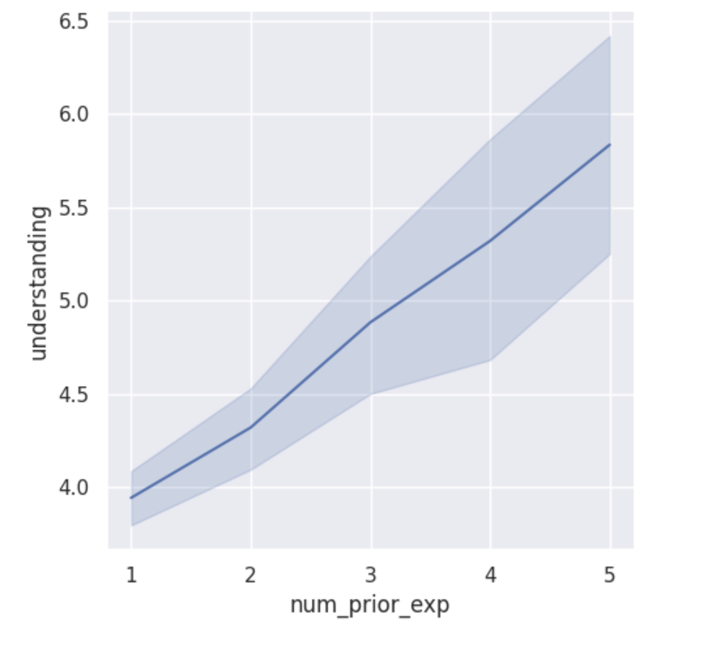
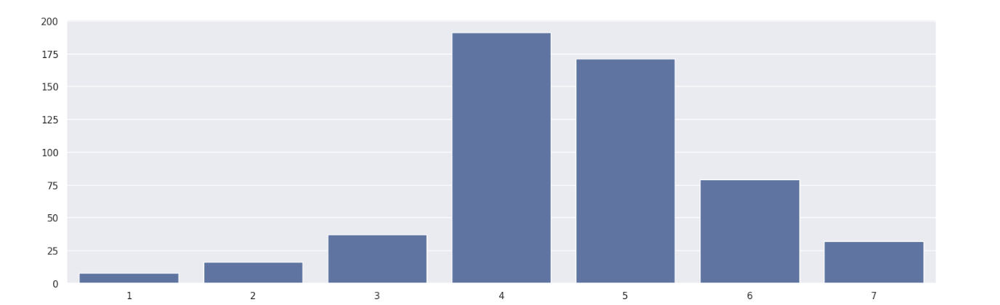
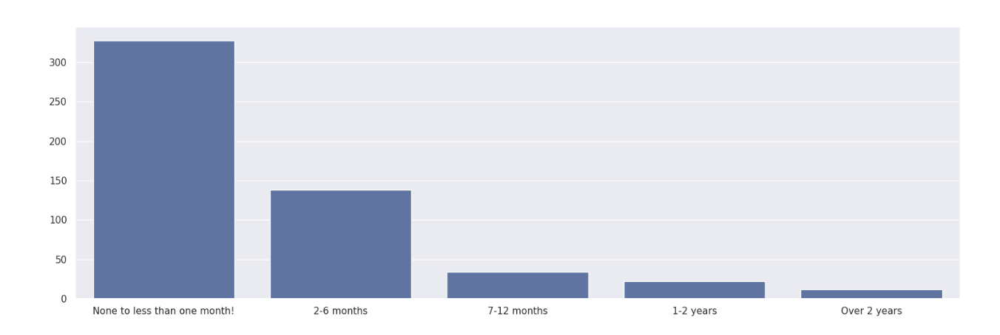

---
# Do not edit the text between these lines!
layout: default
---

# The Idea:
Our idea to analyze with available data was that this course should move at a faster pace because it will make it easier for students to stay focused and engaged in class.
This idea is more valuable than some of the others that we brainstormed because it is the simplest fix, and pacing relates to many other factors. Pacing is important - too slow, and students lose interest, too fast, and students get lost. If students can’t focus and follow along, they can become bored and tune out information they think they already know, or they can become confused and struggle to catch up and complete work on time. Each of these extremes negatively impact understanding and academic performance. Thus optimal pacing will enhance both student satisfaction in the class and student engagement, which will boost learning.
Analysis was performed that compared the variable “pace” (rated 1-7 on a scale of too slow to too fast), as it compares to note taking, understanding, interest, and prior experience. The results of these analyses are presented below.

<!-- This is a comment. Below, you'll see code for inserting an image. To make this image appear, update <custom-path>. To add an image, save it inside the imgs folder of this repository. -->

## Analysis:
## Note Taking as it relates to a Pacing Perspective:

The first bar graph shows that regardless of how much students take notes in class, they feel that the pacing of the class is mostly moderate, though there is a slight positive relationship.

The line graph shows that the people who take more notes are the ones who feel that the class is paced faster, however, there is only about a one point difference pacing persepctive within the range of note-taking.

The series of line graphs that make up the third visual representation of this section add in an additional factor: understanding. These graphs show a similar minimal trend in pacing perspective across note-taking lines, but they reveal that generally, those with a greater level of understanding feel that the pace of COMP110 is moving more slowly.

### Understanding and Interest as they relate to pacing perspective

The first bar graph shows that generally, a greater sense of understanding is correlated with a sense that the class is moving at a slower pace.

The second bar graph shows that there isn’t a strong relationship between pacing perspective and how interesting students find the class to be.

The final line graph shows that students find that the class is more interesting when they understand it better. It also shows us that the students who understand the class better feel that it is moving too slowly, while the students with lower levels of understanding feel that it is moving too quickly.

### Pacing Perspective as it relates to Prior Experience

This line graph shows that, unless students have a high level of prior experience, they are unlikely to think the class is moving at a faster-than-average pace.

Our second line graph also shows that higher levels of understanding are related to increased prior experience.

### Pace Rating Counts

The graph above shows that most people feel that the pacing of the class is average or slightly faster than average.

### Prior Experience

The graph above shows that most people have six months or less of prior programming experience.

## The Conclusion:

My analysis of the data does not definitively support my initial proposal that the pacing of COMP110 be sped up. In my analysis, I found that indicators of class engagement, like note-taking, were correlated with perspectives that the class was fast-paced. I also found that indicators of class performance, like levels of understanding, decreased as the the pacing perspective got faster. Additionally, I found that the people who understood COMP110 content better felt that the class was moving to slowly and they had more prior experience. These findings at first made me think that the class was too slow of a pace. However, I had to go back to the first two graphs I had made, when I was visualizing the counts of my prior_exp variables and my pace variables. While a too-slow-pace is correlated with a greater understadning, it is important to note that this subset of people is NOT the majority of students in COMP110. Most of the survey respondents had less than six months of coding experience and felt the class was moving at an average or above average pace. Thus, most COMP110 students would NOT actually benefit from an increase in pace, because most COMP110 students do NOT have above average understanding levels or feel that the pace of the class is moving to quickly. Thus, while the experienced or understanding students would benefit and be more enriched by a faster pace, the majority of COMP110 students would actually suffer, because increasing the pace would make students even more lost and confused (decrease understanding levels).

Future analysis should compare grades, more descriptive measures of academic performance, across pacing perspectives to identify if the class is too fast or too slow. Furthermore, more measures of class engagement can be used to determine whether or not other changes can be made to the pacing or structure of the class.

Ultimately, my suggestion is that the pacing remain as it is. I, personally, felt that the pacing was too slow, but most students felt the pacing was average or just above average, which is adequate for an intro-level college course. Thus, I feel that the pacing should remain the same to accomodate the learning processes and understanding levels of most students in COMP110.

